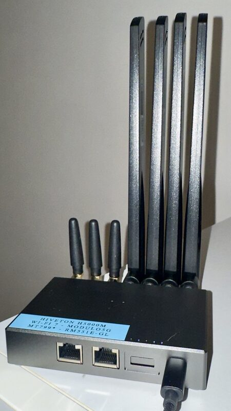
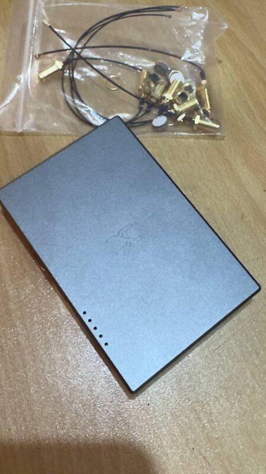
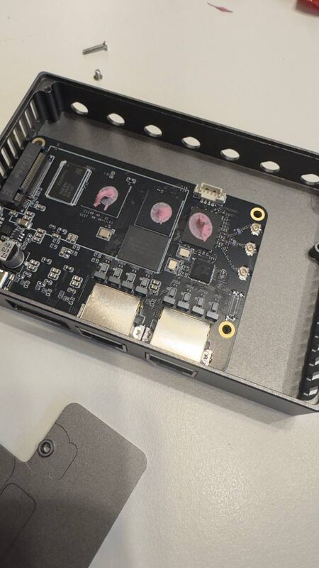
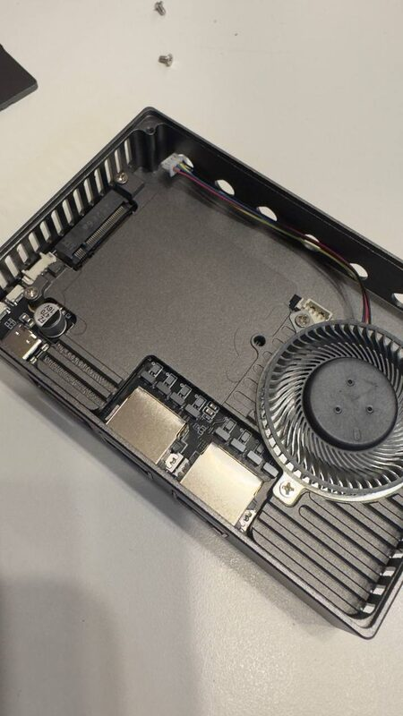

# Hiveton H5000M — Bridge Mode con Quectel RM551E-GL (iamromulan)

Configurazione documentata di un router **Hiveton H5000M** con **ImmortalWrt 24.10** in bridge mode con il modulo 5G **Quectel RM551E-GL** (firmware custom [iamromulan](https://github.com/iamromulan)).

> 🇬🇧 [Read in English](README.md)

## Hardware

| Dispositivo | Descrizione |
|---|---|
| **Hiveton H5000M** | Router WiFi 6, MediaTek MT7992, ARMv8 quad-core |
| **Quectel RM551E-GL** | Modulo 5G SA/NSA, firmware iamromulan (OpenWrt 23.05.4) |

<p align="center">
  
  
</p>
<p align="center">
  <em>Hiveton H5000M (sinistra) — Quectel RM551E-GL con cavi antenna (destra)</em>
</p>

### Interno

<p align="center">
  
  
</p>
<p align="center">
  <em>PCB H5000M (sinistra) — modulo RM551E-GL installato all'interno dell'H5000M (destra)</em>
</p>

## Idea di base

Il modulo Quectel RM551E-GL è connesso al router H5000M via USB. Grazie al driver `cdc_ether`, il modulo appare come interfaccia Ethernet (`usb0`) e viene incluso nel bridge `br-lan` insieme alla porta LAN fisica (`eth1`) e alla radio WiFi 5GHz (`rai0`).

Il risultato è una rete flat dove il modulo 5G fa da gateway per tutti i client WiFi e LAN, senza NAT doppio.

## Struttura repo

```
├── airpi/
│   └── scripts/
│       ├── bannerwrt.sh        # Banner ASCII tricolore SSH
│       ├── info.sh             # Quick Info dinamica SSH
│       └── profile.d/
│           └── airpi_motd.sh   # Launcher MOTD al login
├── romulano/
│   └── scripts/
│       ├── bannerwrt.sh        # Banner ASCII tricolore SSH
│       └── info.sh             # Quick Info dinamica SSH
└── docs/
    ├── architecture.md         # Schema rete e bridge mode
    ├── setup-airpi.md          # Guida configurazione H5000M
    └── setup-romulano.md       # Guida configurazione Quectel RM551E-GL
```

## Firmware

- **H5000M:** `immortalwrt-mediatek-filogic-hiveton-h5000m-squashfs-sysupgrade.bin` — ImmortalWrt 24.10-SNAPSHOT
- **Quectel RM551E-GL:** firmware iamromulan — `RM551EGL00AAR02A02M8G_2025_12_08_iamromulan_basic_eth`

## Cosa è stato configurato

- Bridge `br-lan` = `eth1` + `usb0` + `rai0` (WiFi 6 / 5GHz / HE80)
- Router H5000M senza NAT — gateway diretto sul modulo Quectel RM551E-GL
- DHCP con `authoritative=1`, gateway e DNS puntati al modulo
- Rimozione completa di ModemManager e pacchetti correlati (non necessari con `cdc_ether`)
- Rimozione di bandix pre-installato dal firmware iamromulan sul Quectel RM551E-GL (~330 MB RAM liberati)
- `irqbalance` abilitato
- Flow offloading disabilitato (prerequisito per il monitoraggio bandix/eBPF)
- [bandix](https://github.com/timsaya/openwrt-bandix) + [luci-app-bandix](https://github.com/timsaya/luci-app-bandix) installati per il monitoraggio del traffico in tempo reale
- MOTD personalizzato su entrambi i dispositivi (banner tricolore + quick info)
- ZeroTier per accesso remoto

## Compatibilità

Anche se questo setup è stato testato con il **Quectel RM551E-GL**, può essere riprodotto con qualsiasi modulo supportato dal firmware custom di [iamromulan](https://github.com/iamromulan). Il progetto iamromulan fornisce firmware basato su OpenWrt per diversi moduli Quectel — controlla il suo GitHub per la lista completa dei dispositivi supportati.

> Tutto il merito per il firmware del modulo va a **[iamromulan](https://github.com/iamromulan)** — senza il suo lavoro questo setup non sarebbe possibile.

## Note

- Le disconnessioni LTE periodiche (~4h) sono normali nel mio caso — uso una SIM WindTre e il provider rinegozia l'IP ogni ~4 ore
- SQM/cake non installabile né su H5000M né su Quectel RM551E-GL (kmod non disponibile per queste architetture)
